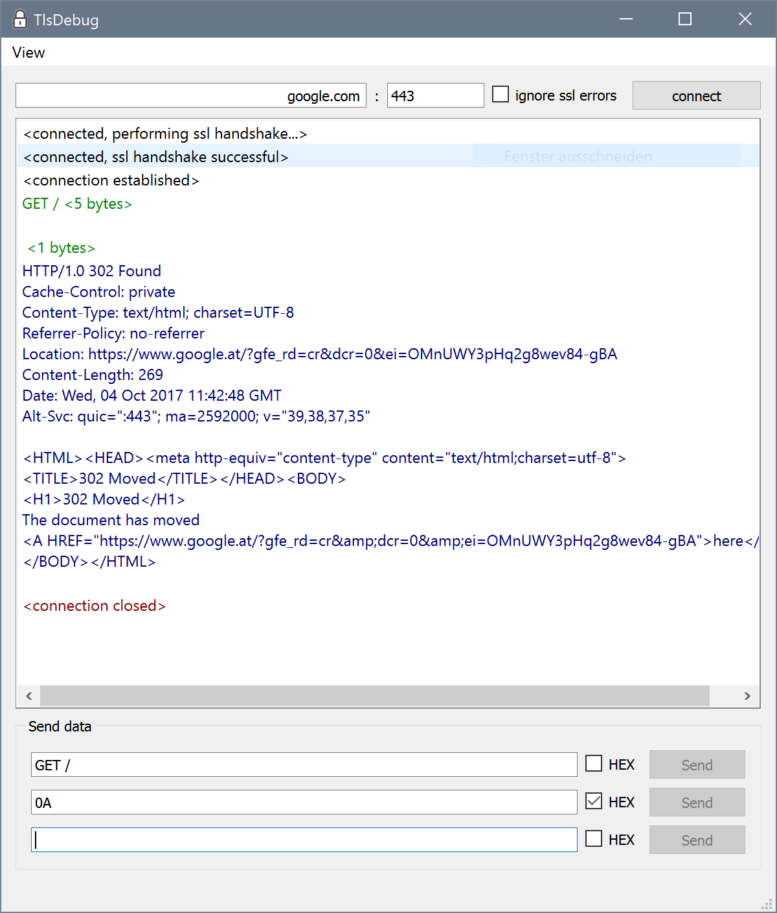
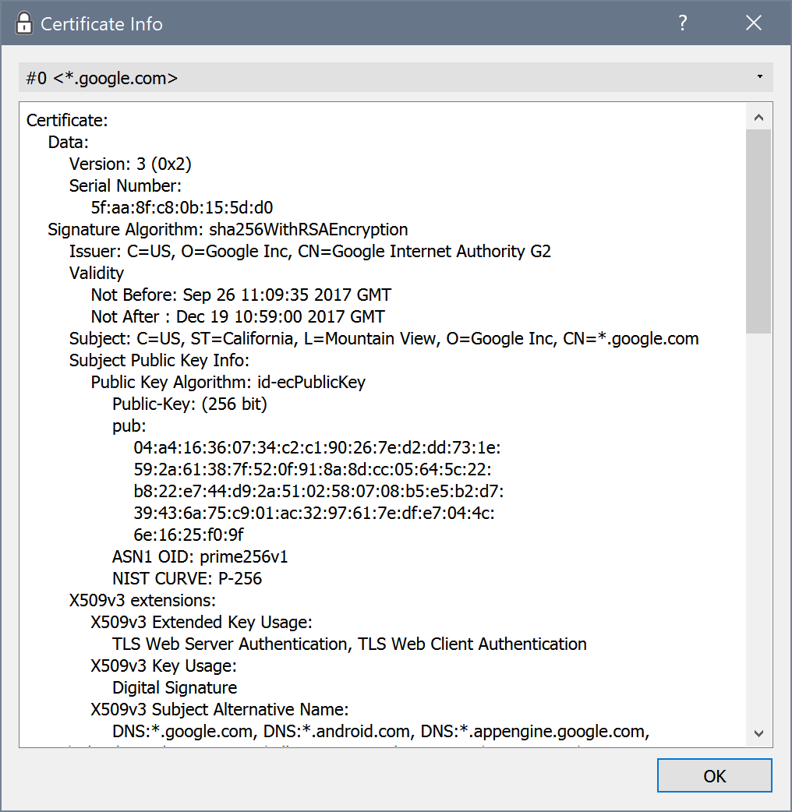

# TlsDebug

A quick & dirty hack to debug connections on top of TLS. After connecting to a server, enter text to send in one of the fields and hit send. You can send special characters by using the HEX checkbox and entering their hex values. Data sent is logged in green, data received in blue, info messages in black and errors in red.

You can take a look at the certificates presented by the server via the menu option.

## Building

Use [Qt Creator](https://qt.io) to open the .pro file and hit run. Prebuilt binaries for Windows (Oct 2016) can be found [here](https://bbrandner.com/tlsdebug).

## Example: HTTPS

